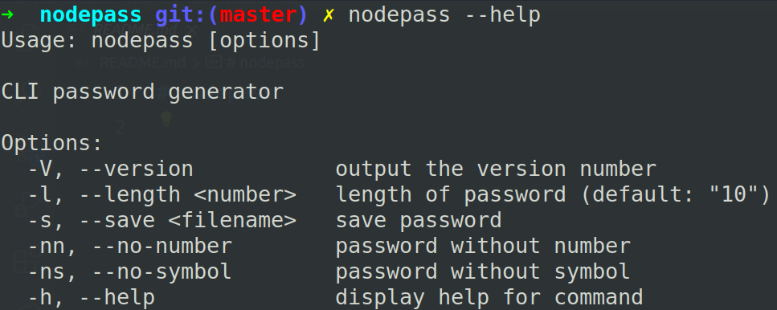
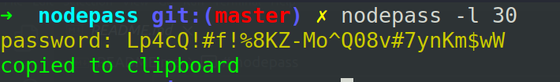
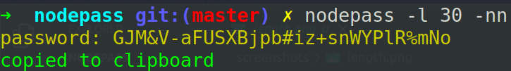
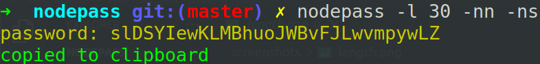
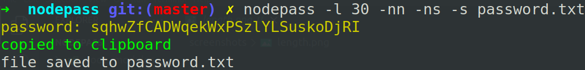

# nodepass

nodejs cli password generator

**Installation**

```bash
git clone https://github.com/kaungthantzindev/nodepass
cd nodepass
npm install
```

**run**

```bash
nodepass --help
```

**help**

**length**

**no number**

**no symbol**

**filesave**

